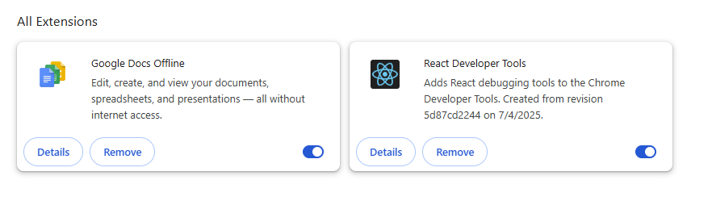

# Task 7: Identify and Remove Suspicious Browser Extensions

## Objective
The objective of this task is to identify and remove any suspicious or unused browser extensions that could pose security risks. This helps improve browser security and performance.

---

## Tools Used
- **Browser:** Google Chrome
- **OS:** Windows 11 Pro
- **Built-in Chrome Extensions Manager**

---

## Screenshots

### Before Removal (All Extensions)

### Before Removal (Extension Details)
#### Google Docs Offline

#### HTML5 Outliner

#### React Developer Tools

#### Selectext: Copy Text from Videos

#### Web Server for Chrome

---

### After Removal (Only Safe Extensions)

---

## Steps Performed

1. **Opened Extensions Manager**
   - Navigated to `chrome://extensions/` to see the list of installed extensions.

2. **Reviewed Each Extension**
   - Checked name, description, permissions, and site access.
   - Verified if each extension was needed and trusted.

3. **Analyzed Permissions**
   - Looked for permissions like “Read and change all your data on all websites” or “Access browsing history” which could be risky.

4. **Identified Suspicious/Unused Extensions**
   | Extension Name | Status | Reason |
   |----------------|--------|--------|
   | Google Docs Offline | ✅ Safe | Default Google extension, trusted. |
   | HTML5 Outliner | ⚠ Review | Reads/changes data on sites. Not essential for regular browsing. |
   | React Developer Tools | ✅ Safe (For Devs) | Needed for React development, but not for general users. |
   | Selectext: Copy Text from Videos | ⚠ Review | Reads/changes all site data, needs trust check. |
   | Web Server for Chrome | ⚠ Review | Can exchange data & write to files, remove if not used. |

5. **Removed Unnecessary Extensions**
   - Deleted extensions that were not in use or had unnecessary high permissions.

6. **Restarted Browser**
   - Ensured changes took effect.

7. **Rechecked Extensions List**
   - Confirmed only required extensions remained.

---

## Outcome
- Awareness of the security risks of browser extensions.
- Removed unused/suspicious extensions to reduce attack surface.
- Improved browser performance and security.

---

## Key Learnings
- Always check permissions before installing an extension.
- Extensions from unknown developers can be dangerous.
- Unused extensions should be removed to avoid hidden risks.

---

## References
- [Google Chrome Extensions Help](https://support.google.com/chrome_webstore/answer/2664769)
- [Browser Extension Security Risks](https://www.kaspersky.com/resource-center/threats/browser-extensions)

---
